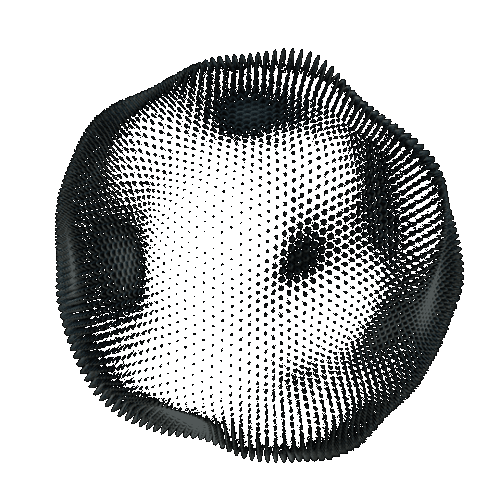

  

 
<table>
  <tr>
    <td colspan="2" align="center" valign="middle">
      
      &nbsp;
      
      &nbsp;
      
    </td>
  </tr>
  <tr>
    <td colspan="2" valign="middle">
      <h3>Hey there! I'm Lucas 👋</h3>
    </td>
  </tr>
  <tr>
    <td valign="middle" width="70%">
       
      <b>Computer Science Student & R&D Intern</b>  
      I'm a CS student at IFSC Campus Lages, focused on generative AI integration and automation engineering with international experience from a cultural and educational exchange program in London.  
      Currently interning in Innovation & R&D, where I build production automations with n8n and integrate generative AI models (Gemini, Anthropic) into real workflows. My next step is working as an AI/ML Engineer.  
      
  

  

  

    </td>
    <td align="center" valign="middle" width="30%">
      
    </td>
  </tr>
</table>

    

